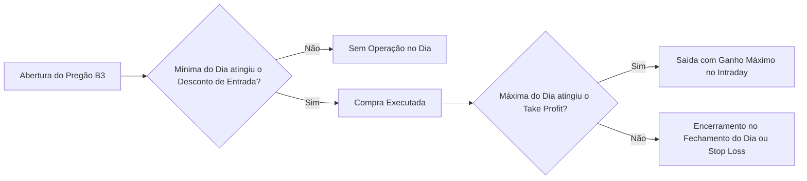
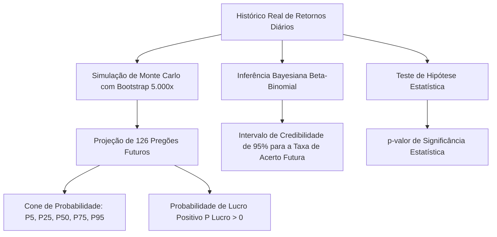

# 📈 Sistema de Análise Estatística & Preditiva de Day Trade na B3

> Software quantitativo em Python para análise de recorrência, backtesting e modelagem preditiva estocástica de operações Day Trade no mercado de ações brasileiro (B3).

---

## 🎯 Visão Geral do Projeto

Este projeto foi desenvolvido com o objetivo de responder a três perguntas fundamentais para estratégias quantitativas de Day Trade aplicadas às ações da Bolsa Brasileira (B3):

1. **Recorrência Histórica**: Quantas vezes e com que frequência determinada assimetria de preço (ex: recuo em relação à abertura do dia ou fechamento anterior) ocorreu ao longo dos últimos 6 meses (ou períodos customizados)?
2. **Rentabilidade Real e Expectativa Matemática**: Qual foi o lucro acumulado, taxa de acerto (*Win Rate*), fator de lucro (*Profit Factor*) e *drawdown* máximo ao buscar alvos intraday (ex: 3%, 5%, 10%) com saída no mesmo dia?
3. **Probabilidade Preditiva Futura**: Qual é a probabilidade estatística de essa estratégia continuar lucrativa e atingir metas financeiras nos próximos 6 meses (próximos 126 pregões úteis)?

---

## 🧠 Modelagem Quantitativa & Estratégia Operacional

### 1. Mecânica da Estratégia Intraday



- **Referência de Preço**: Fechamento do dia anterior ($Fechamento_{t-1}$) e Preço de Abertura do dia ($Abertura_t$).
- **Gatilho de Compra**:
  - *Opção A*: Desconto percentual em relação à abertura ($Preço_{entrada} = Abertura_t \times (1 - \frac{\Delta\%}{100})$).
  - *Opção B*: Desconto em pontos/reais em relação à abertura ($Preço_{entrada} = Abertura_t - \Delta$).
  - *Opção C*: Desconto percentual em relação ao fechamento anterior ($Preço_{entrada} = Fechamento_{t-1} \times (1 - \frac{\Delta\%}{100})$).
- **Validação de Execução**: A operação somente é disparada se a **Mínima do dia** for menor ou igual ao preço de entrada ($Mínima_t \le Preço_{entrada}$).
- **Regra de Saída (Take Profit)**: Se a **Máxima do dia** alcançar o alvo ($Máxima_t \ge Preço_{entrada} \times (1 + \frac{Alvo\%}{100})$), a operação é encerrada com ganho máximo no intraday.
- **Saída Alternativa (Day Trade)**: Caso o alvo não seja atingido, a posição é compulsoriamente liquidada no leilão de **Fechamento do dia** ($Close_t$) ou em nível de **Stop Loss** parametrizado.
- **Custos Operacionais**: Desconto de taxas B3 (emolumentos ~0.03% por perna = 0.06% total) e slippage configurável.

---

### 2. Métricas Estatísticas e Financeiras

- **Taxa de Disparo (Recorrência)**:
  \[
  \text{Frequência de Oportunidade (\%)} = \left( \frac{\text{Total de Pregões com Compra Disparada}}{\text{Total de Pregões Analisados}} \right) \times 100
  \]
- **Taxa de Acerto (*Win Rate*)**:
  \[
  \text{Win Rate (\%)} = \left( \frac{\text{Operações Encerradas no Verde}}{\text{Total de Operações Executadas}} \right) \times 100
  \]
- **Expectativa Matemática por Operação (\(E\))**:
  \[
  E = (P_{win} \times \bar{G}) - (P_{loss} \times \bar{L})
  \]
  Onde $P_{win}$ é a probabilidade de ganho, $\bar{G}$ é o ganho médio percentual, $P_{loss}$ é a probabilidade de perda e $\bar{L}$ é a perda média percentual.
- **Fator de Lucro (*Profit Factor*)**:
  \[
  \text{Profit Factor} = \frac{\sum \text{Lucros Brutos (R\$)}}{\sum \text{Prejuízos Brutos (R\$)}}
  \]
- **Payoff Ratio**:
  \[
  \text{Payoff} = \frac{\bar{G}}{\bar{L}}
  \]
- **Max Drawdown**: Maior queda percentual e financeira de capital a partir de um topo histórico na curva de patrimônio.

---

### 3. Modelos Preditivos para os Próximos 6 Meses



1. **Simulação de Monte Carlo com Bootstrap Não-Paramétrico**:
   - Reamostragem com reposição dos retornos diários observados (incluindo dias sem disparo e dias com trade).
   - Execução de 5.000 a 10.000 trajetórias completas para os próximos 126 pregões úteis (~6 meses).
   - Geração dos cones de probabilidade nos percentis $P_5$ (VaR 95%), $P_{25}$, $P_{50}$ (mediana), $P_{75}$ e $P_{95}$.
   - Estimativa direta de $P(\text{Patrimônio Final} > \text{Capital Inicial})$ e probabilidade de perda máxima.
2. **Inferência Bayesiana (Modelo Beta-Binomial)**:
   - Modela a taxa de acerto do alvo como uma variável aleatória $\theta \in [0, 1]$.
   - A priori uniforme $\text{Beta}(1, 1)$, atualizada para a distribuição a posteriori $\text{Beta}(\alpha + \text{acertos}, \beta + \text{erros})$.
   - Fornece a média a posteriori e o **Intervalo de Credibilidade de 95%** para a taxa de sucesso futura.
3. **Teste de Significância Estatística**:
   - Teste de hipótese unilateral ($H_0: \mu \le 0$ vs. $H_1: \mu > 0$) para verificar se o retorno médio do setup é estatisticamente significante ($p < 0.05$).

---

## 🖥️ Módulos do Dashboard Interativo (Streamlit)

A aplicação conta com uma interface visual rica e responsiva dividida em 5 abas principais:

| Aba | Funcionalidades |
| :--- | :--- |
| **📊 Backtest & Recorrência** | Painel de KPIs, Curva de Capital diária (R$), Gráfico Candlestick interativo com marcadores de entrada e saída, e resumo estatístico do ativo. |
| **🔮 Previsão Próximos 6 Meses** | Gráfico em Cone de Monte Carlo (5.000 simulações), probabilidades de retorno positivo, análise Bayesiana e teste de significância estatística. |
| **🚀 Scanner B3 (Ranking)** | Varredura em lote das principais ações da B3 com o setup configurado, rankeando os ativos mais lucrativos e consistentes. |
| **🎯 Otimizador de Alvos** | Matrizes de calor (*Heatmaps*) testando combinações de Desconto de Entrada vs. Alvo de Lucro (Grid Search) para identificar a zona de maior rentabilidade. |
| **📥 Tabela de Trades & Exportação** | Tabela completa de cada pregão e botões para download dos relatórios em **CSV** e **Excel (.xlsx)**. |

---

## 📂 Estrutura do Repositório

```text
Modelo Estatístico B3/
├── app.py                      # Dashboard Web Interativo (Streamlit)
├── requirements.txt            # Dependências do projeto
├── README.md                   # Documentação detalhada e visão geral
├── src/
│   ├── __init__.py             # Inicializador do pacote
│   ├── data_loader.py          # Coleta e cache de cotações B3 via Yahoo Finance
│   ├── strategy_engine.py      # Motor de simulação intraday (Abertura/Fechamento/Alvos)
│   ├── metrics.py              # Cálculo de métricas estatísticas e financeiras
│   ├── forecast_model.py       # Simulação de Monte Carlo, Bootstrap e Inferência Bayesiana
│   └── optimizer.py            # Otimizador de parâmetros em grade (Grid Search)
└── tests/
    ├── test_strategy.py        # Testes unitários do motor de estratégia e métricas
    └── test_forecast.py        # Testes unitários dos modelos preditivos e bayesianos
```

---

## 🚀 Como Instalar e Executar

### 1. Clonar ou Acessar a Pasta do Projeto
```bash
cd "Modelo Estatístico B3"
```

### 2. Instalar as Dependências
```bash
pip install -r requirements.txt
```

### 3. Iniciar o Dashboard
```bash
streamlit run app.py
```
O sistema abrirá automaticamente uma aba no seu navegador padrão no endereço `http://localhost:8501`.

### 4. Executar a Suíte de Testes Automatizados
```bash
python3 -m pytest tests/ -v
```

---

## ⚙️ Tecnologias Utilizadas

- **Python 3.12+**
- **Streamlit**: Interface gráfica interativa web
- **yfinance**: Coleta de dados históricos da B3 com ajuste de proventos
- **Pandas & NumPy**: Manipulação e vetorização de séries temporais
- **Plotly**: Visualizações interativas (Candlesticks, Cones de Monte Carlo e Heatmaps)
- **SciPy**: Modelagem estatística, distribuições beta e testes de hipótese
- **OpenPyXL**: Geração de relatórios em planilhas Excel
- **PyTest**: Testes unitários e validação contínua

---

## ⚠️ Isenção de Responsabilidade (Disclaimer)

Este software foi desenvolvido exclusivamente para fins de **pesquisa quantitativa, análise estatística e estudo acadêmico**. Rentabilidade passada não é garantia de resultados futuros. Operações de Day Trade no mercado de renda variável envolvem alto risco de perda do capital investido.
